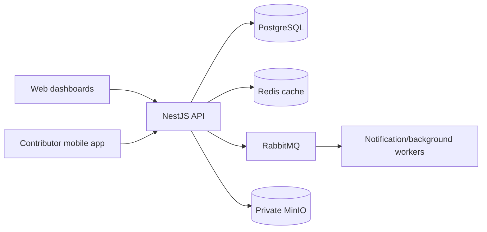
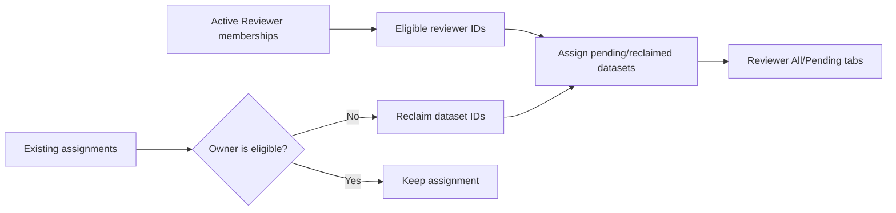

# Mahder E2E Stabilization Report — Backend

## 1. Executive summary

The backend is now aligned with the strict frontend and mobile request contracts
used by the production showcase. The work protects authentication, task
submissions, reviewer decisions, wallet credits, private files, and cached task
assignments without weakening validation.

The latest reviewer fix addresses a live issue where four pending submissions
were attached to a Facilitator user ID. The Reviewer could see the task card but
all review tabs were empty. Distribution now derives eligible users from active
`Reviewer` task memberships and automatically repairs invalid assignments.

## 2. System illustration



Files remain private. The API generates temporary signed MinIO URLs instead of
making the bucket public.

## 3. What was improved

### Authentication and authorization

- Preserved account-state checks, scoped task access, assignment checks, refresh
  sessions, and rate limiting.
- Retained SuperAdmin as the only administrative showcase role.
- Removed the old hard-coded seed password; guarded demo seeding now requires a
  private `DEMO_USERS_PASSWORD` environment value.
- Kept all passwords and service credentials outside the repository.

### Contributor submissions and payment safety

- Validated text/audio attempts per microtask.
- Allowed rejected work to be retried without counting it as new progress.
- Kept approval/rejection credits idempotent and external withdrawals disabled.

### Reference data and cache consistency

- Returned dialect and region descriptions for complete edit prepopulation.
- Cleared contributor task-list and task-detail caches only after a successful
  redistribution transaction.

### Reviewer visibility repair

Before:

```text
Task membership:     rev@gmail.com  -> Reviewer
Review assignment:   faci@gmail.com -> 4 submissions (incorrect)
Reviewer tabs:       All 0 | Pending 0 | Approved 0 | Rejected 0
```

After:



The distribution cursor was also corrected so three or more reviewers do not
skip a submission, and the last reviewer receives an assignment notification.

## 4. Verification performed

- `npm run lint`
- `npm run typecheck`
- Full Jest suite: 30 suites / 250 tests passed, including redistribution-cache
  and reviewer-distribution regression coverage.
- Production image built and started successfully.
- Public API and private-storage health checks returned HTTP 200.
- Six showcase accounts and the retained project/task/microtask/dataset records
  remained present after deployment.
- Live reviewer redistribution returned HTTP 201 and moved all four pending
  submissions from the invalid Facilitator assignment to `rev@gmail.com`.
- The Reviewer API now returns one task with `All = 4` and `Pending = 4`.

## 5. Manual E2E path

1. Add `rev@gmail.com` to the task as Reviewer.
2. Submit four contributor datasets.
3. Run **Reviewer task distribution** once.
4. Log in as Reviewer and open **Tasks**.
5. Confirm the task appears and **All** / **Pending** show four submissions.
6. Approve three, reject one, retry the rejected item, and approve the retry.
7. Confirm contributor and reviewer wallet deltas without using withdrawals.

The detailed credential-free runbook is in
[`docs/NETCUP_E2E_OPERATIONS.md`](docs/NETCUP_E2E_OPERATIONS.md).

## 6. Known limitations

- OneSignal delivery is intentionally disabled until private production
  OneSignal/Firebase configuration is available.
- External withdrawals remain disabled.
- Final recording, keyboard-open, rejection/retry, and wallet evidence remains a
  manual role-based E2E activity.

---

## 7. Pull request — copy/paste

### PR title

```text
fix: stabilize reviewer distribution and production E2E consistency
```

### PR target

```text
main
```

### PR description

#### Summary

Stabilizes the production Mahder E2E workflow across contributor submissions,
reference-data editing, redistribution caches, showcase users, and reviewer task
distribution.

#### Main changes

- Align the six guarded showcase users while preserving stable identities and
  existing wallet/score records.
- Require the demo-user password from a private environment variable rather than
  storing a password in source or documentation.
- Return dialect and region descriptions needed by frontend edit forms.
- Clear contributor list/detail caches only after redistribution commits.
- Select active Reviewer memberships directly for review distribution.
- Reclaim and reassign datasets owned by invalid reviewer-assignment rows.
- Fix multi-reviewer allocation so no pending datasets are skipped.
- Add focused transaction, cache, and reviewer-distribution regression tests.
- Add the illustrated stabilization report and Netcup E2E runbook.

#### Verification

- Backend lint passed with no errors.
- TypeScript typecheck passed.
- Full Jest suite passed: 30 suites / 250 tests, including the new cache and
  reviewer-distribution tests.
- Production build and health checks passed.

#### Safety notes

- No credentials are included.
- MinIO remains private and uses signed URLs.
- External withdrawals and OneSignal delivery remain disabled.
